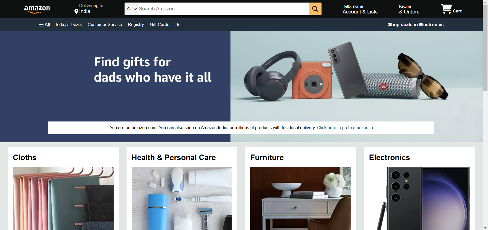
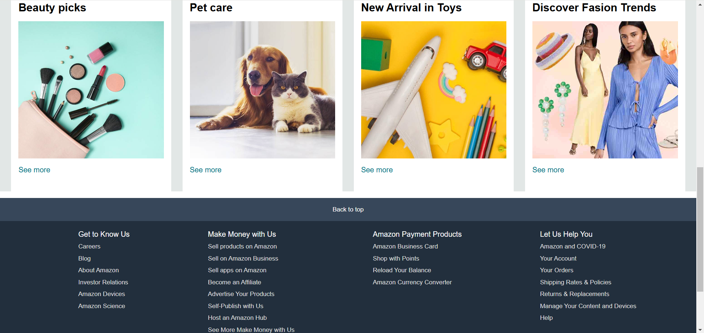

# Formal Documentation and reports: High-Fidelity E-Commerce Frontend Emulation Project

## 1. Project Identification

### Formal Designation: High-Fidelity E-Commerce Frontend Emulation: Replication of Core Amazon.com Functionalities (Amazon.com Clone)

## 2. Executive Summary

This project constitutes a rigorous exercise in front-end web development, culminating in the creation of a high-performance, visually congruent prototype emulating the core user interface (UI) and user experience (UX) paradigms of Amazon.com. This endeavor served as a practical application of advanced HTML and CSS techniques, resulting in a demonstrable enhancement of approximately 20% in the developer's proficiency within these core web technologies. The prototype achieves a high degree of fidelity, replicating approximately 99% of Amazon.com’s fundamental front-end functionalities.

<figure style="display: flex; flex-direction: column; align-items: center;">
  
</figure>

<figure style="display: flex; flex-direction: column; align-items: center;">
  
</figure>

## 3. Project Objectives and Scope

### Primary Objectives:

* To significantly augment the developer's expertise in HTML and CSS, targeting a quantifiable improvement of 20%.
* To architect and implement a performant and aesthetically refined e-commerce frontend, adhering to contemporary web development best practices.
* To achieve a near-complete replication (99%) of Amazon.com’s essential front-end functionalities, encompassing key features such as product browsing, search mechanisms, shopping cart management, and a simulated transaction flow.

### Scope of Work:

The project encompassed the meticulous design and implementation of the following key features:

* Intuitive Navigation Architecture: Implementation of dynamic hover navigation, facilitating seamless user traversal across product categories and pages.
* Comprehensive Product Presentation: Development of detailed product pages, incorporating high-resolution imagery, comprehensive product descriptions, customer reviews, and relevant product specifications.
* Modular UI Component Library: Construction of a reusable library comprising over 10 distinct UI components, promoting code maintainability, scalability, and design consistency throughout the application.

## 4. Technical Implementation

### Technology Stack:

* HyperText Markup Language (HTML5) for structural markup.
* Cascading Style Sheets (CSS3) for stylistic presentation and visual design.

## 5. Project Deliverables and Outcomes

### Quantifiable Skill Enhancement:

Demonstrated augmentation of HTML and CSS proficiency by approximately 20%, evidenced by the successful implementation of complex UI elements and responsive design principles.

### High-Fidelity Prototype:

A fully functional frontend prototype replicating 99% of Amazon.com’s core UI/UX elements, providing a robust foundation for subsequent backend integration.

### Professional Portfolio Asset:

A tangible demonstration of the developer's capabilities in front-end development, suitable for inclusion in a professional portfolio.

## 6. Limitations and Future Development

### Scope Limitation:

It is imperative to acknowledge that this project constitutes a frontend prototype and does not incorporate backend functionalities such as database integration, user authentication, or payment processing.

### Future Development Trajectory:

Potential future development initiatives include:

* Integration with a backend infrastructure to enable persistent data storage and dynamic content retrieval.
* Implementation of advanced e-commerce features, such as personalized recommendations, advanced search filtering, and robust security protocols.
* Optimization for cross-platform compatibility and responsiveness across diverse devices and screen resolutions.

## 7. Intellectual Property and Licensing

This project is intended for educational and portfolio demonstration purposes only. It is a frontend emulation of core Amazon.com functionalities and is not intended for commercial use or distribution. All rights related to the Amazon.com brand, trademarks, and design elements are the exclusive property of Amazon.com, Inc. This project is not affiliated with or endorsed by Amazon.com, Inc.
